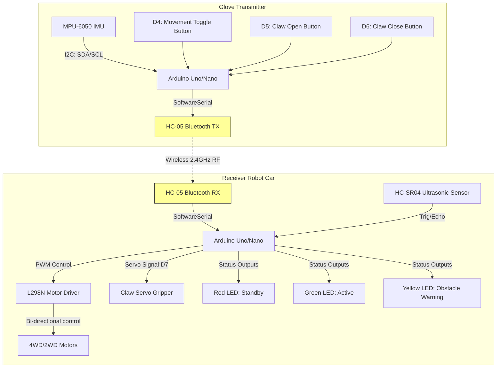

# Hand-Gesture-Controlled-Robot-Car-With-Claw 🤖🤚🚗

A state-of-the-art, dual-Arduino system featuring a gesture-controlled wearable glove transmitter and a robotic receiver car equipped with a robotic claw/gripper, dynamic status feedback, and safety systems.

The glove reads tilt data from an **MPU-6050 IMU** (Pitch & Roll) to translate hand movements into precise, proportional speed and direction commands. It communicates wirelessly via **HC-05 Bluetooth** to the receiver car, which features an **L298N H-Bridge motor driver**, a **robotic gripper/claw** controlled via a servo, and an **HC-SR04 Ultrasonic sensor** for real-time obstacle alerts.

---

## 📌 System Architecture

---

## ✨ Features & Capabilities

### 🖐️ Gesture Glove (Transmitter)
* **MPU-6050 Motion tracking**: Highly sensitive inertial measurement unit (IMU) reads pitch and roll.
* **Proportional Speed Scaling**: The car doesn't just go or stop; speed scales dynamically from `30` to `255` based on your tilt angle (from `30°` to `70°`).
* **Safety Lock (Movement Toggle)**: D4 acts as a physical toggle. When OFF, the glove goes into safety standby to prevent accidental movements.
* **Continuous Claw Hold Buttons**: Hold-to-adjust buttons for open (D5) and close (D6) actions allow fine positioning of the gripper claw.

### 🏎️ Robotic Claw Car (Receiver)
* **L298N Power Control**: Drives high-torque DC motors using pulse-width modulation (PWM) for speed control.
* **Smooth Servo Gripper**: Micro-stepping algorithm changes claw angle by `8°` per update instead of instantly snapping, providing silky-smooth gripping.
* **Failsafe Bluetooth Timeout**: Automatically stops the car (`S0`) if connection drops or no command is received for `500ms`, avoiding runaway hardware.
* **Ultrasonic Distance Monitor**: Continuous scanning at 10Hz. Activates a Yellow warning LED when an obstacle is within `15cm`.
* **State indicator LEDs**:
  * 🔴 **Red LED**: Hand-control is locked/standby.
  * 🟢 **Green LED**: Active control enabled (movement mode ON).
  * 🟡 **Yellow LED**: Obstacle warning.

---

## 🛠️ Bill of Materials (BOM) & Pin Out

### 1. Transmitter Glove Pinout
| Component | Arduino Pin | Description |
| :--- | :--- | :--- |
| **HC-05 Bluetooth** | D2 (RX), D3 (TX) | Serial Bluetooth transceiver |
| **MPU-6050 IMU** | A4 (SDA), A5 (SCL) | I2C motion sensor |
| **Movement Button** | D4 | Toggle active hand control (Internal Pullup) |
| **Claw Open Button**| D5 | Stepwise open claw (Internal Pullup) |
| **Claw Close Button**| D6 | Stepwise close claw (Internal Pullup) |

### 2. Receiver Robot Car Pinout
| Component | Arduino Pin | Description |
| :--- | :--- | :--- |
| **HC-05 Bluetooth** | D2 (RX), D3 (TX) | Serial Bluetooth transceiver |
| **L298N ENA / ENB** | D5, D6 | Motor A/B Speed controls (PWM) |
| **L298N IN1 to IN4** | D8, D9, D10, D11 | Motor directional phase inputs |
| **Servo Gripper** | D7 | PWM control pin for claw servo |
| **Ultrasonic Sensor**| D12 (Trig), D13 (Echo)| Distance scanner |
| **Red LED** | A0 | Standby mode indicator |
| **Green LED** | A1 | Active movement mode indicator |
| **Yellow LED** | A2 | Proximity warning indicator |

---

## 📡 Serial Packet Protocol

The system utilizes a custom, compact lightweight ASCII-encoded serial protocol over Bluetooth to guarantee maximum reactivity and minimal packet overhead. Packets are terminated with a newline (`\n`).

### Message Structure: `[CommandCharacter][NumericValue]\n`

| Command | Allowed Values | Action on Receiver |
| :---: | :--- | :--- |
| **`F`** | `0` to `255` | Drive Forward at calculated PWM speed |
| **`B`** | `0` to `255` | Drive Backward at calculated PWM speed |
| **`L`** | `0` to `255` | Pivot Left at calculated PWM speed |
| **`R`** | `0` to `255` | Pivot Right at calculated PWM speed |
| **`S`** | `0` | Hard Stop (All motors set to 0 PWM) |
| **`M`** | `0` (Off) or `1` (On) | Toggle Movement mode (active states and LEDs) |
| **`O`** | `0` | Decrements Claw Servo angle (Towards open angle: `70°`) |
| **`C`** | `0` | Increments Claw Servo angle (Towards close angle: `120°`) |

---

## 📂 File Architecture

* [glove.cpp](file:///c:/Users/hasin/Desktop/Hand%20Gesture%20Controlled%20Robot%20Car/glove.cpp) : C++ Source code for the Wearable Glove Controller. Includes I2C MPU-6050 reading, button debouncing, dynamic speed calculation, and HC-05 packet broadcasting.
* [car.cpp](file:///c:/Users/hasin/Desktop/Hand%20Gesture%20Controlled%20Robot%20Car/car.cpp) : C++ Source code for the Robot Car. Manages serial packet parsing, L298N logic, servo positioning, ultrasonic polling, status LEDs, and the safety watchdog timer.

---

## 🚀 Operating Instructions

1. **Powering Up**:
   * Turn on both the glove controller and the receiver robot car.
   * Make sure the HC-05 modules pair automatically (indicated by slow flashing LEDs).
2. **Engaging Movement Mode**:
   * Press the **D4 Movement Button** on the glove once. The status LED on the car will change from 🔴 **Red** (Standby) to 🟢 **Green** (Active).
3. **Driving the Car**:
   * Tilt your hand forward (Pitch > 30°) to move **Forward**.
   * Tilt your hand backward (Pitch < -30°) to move **Backward**.
   * Tilt your hand right (Roll > 30°) to rotate **Right**.
   * Tilt your hand left (Roll < -30°) to rotate **Left**.
   * Tilt angles between `-30°` and `30°` represent a **neutral zone**, bringing the car to a halt.
   * Speed increases linearly the further you tilt your hand!
4. **Using the Claw**:
   * Hold down the **D5 Button** on the glove to gradually open the gripper claw.
   * Hold down the **D6 Button** on the glove to gradually close the gripper claw.
5. **Safety Systems**:
   * Pressing the **D4 Button** again will immediately lock the car, turning off all motors and returning the status LED to 🔴 **Red**.
   * If the car gets too close to an obstacle, the 🟡 **Yellow LED** will light up on the car chassis to alert you.
   * If connection drops or the glove runs out of battery, the car will automatically stop in under `500ms`.
